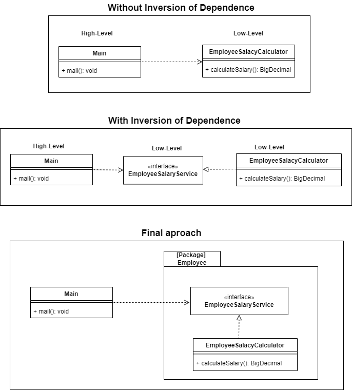

# Príncipio da Inversão de Dependência - DIP

The Dependency Inversion Principle (DIP) advocates that in a software system, high-level modules should depend on abstractions rather than details and low-level modules.

### High-level modules
> Business logic classes, theyn change with certain regularity.

### Details/low-level
> These classes don't change with regularity. Frameworks, drivers. 

### Why Dependency Inversion is Worth Using?
* Decoupling modules makes the code easy to maintain and test.
* It prevents breaks by keeping high-level components isolated.
* It improves code reusability.
* It makes it easier to extend the application's classes.

## Example Project
The project features a module for calculating an employee's salary.

To ensure the Dependency Inversion Principle (DIP), our high-level class (Main) should not include any reference to the low-level detail EmployeeSalaryCalculator. That's why the EmployeeSalaryService interface is used.

## Links
[DIP in the Wild](https://martinfowler.com/articles/dipInTheWild.html)

[SOLID](https://en.wikipedia.org/wiki/SOLID)
