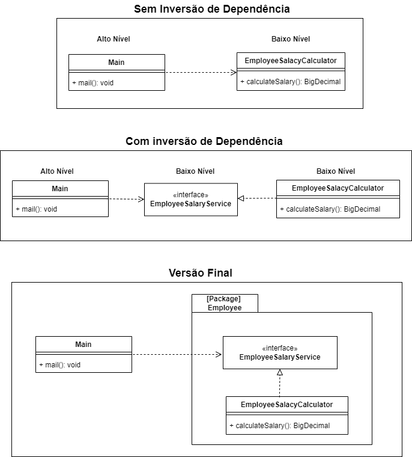

# Príncipio da Inversão de Dependência - DIP

O princípio DIP advoga que em um sistema de software módulos de alto nível devem depender de abstrações
ao invés dos detalhes e módulos de baixo nível.

### Módulos de alto nível
> São as classes e funçõe de entrada, mais fáceis de serem entendidas,que não possuem lógica complexa.

### Detalhes/baixo nível
> São as classes que possuem logica mais complexa, regras de neógcio, implementações.

### Benefícios
* Desacoplar módulos torna o código fácil de manter e testar.
* Isso evita quebras ao manter componentes de alto nível isolados.
* Melhora a reutilização de código.
* Torna mais fácil estender as classes da aplicação.

## Projeto de Exemplo
O projeto apresanta um módulo para calcular o salário de um empregado.

Para garantir o DIP, nossa classe de alto nível (Main) não deve incluir nenhuma referência para o detalhe de baixo nível EmployeeSalaryCalculator, por isso é usada a Interface EmployeeSalaryService

## Links
[DIP in the Wild](https://martinfowler.com/articles/dipInTheWild.html)

[SOLID](https://en.wikipedia.org/wiki/SOLID)